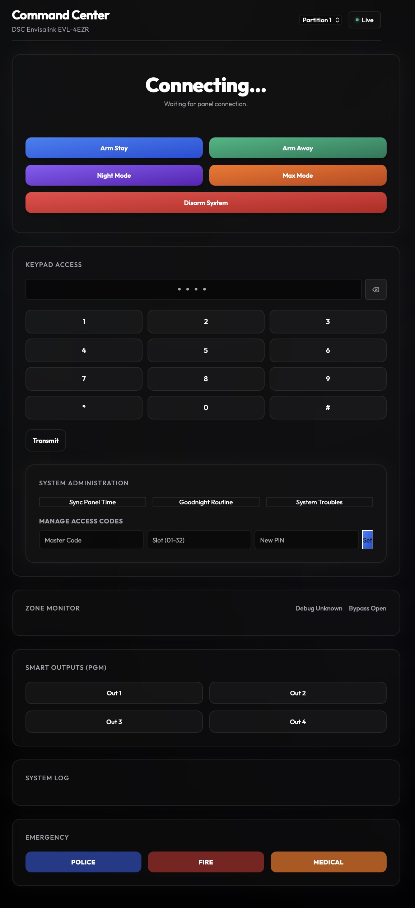
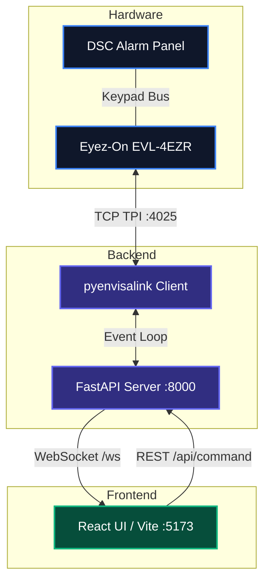

# EVL-4EZR Command Center

A dynamic, web-based UI for managing an Eyez-On Envisalink EVL-4EZR IP Security Interface Module connected to a DSC panel.



## Architecture



This project is built using a modern decoupled hybrid stack:

1. **Backend (Python / FastAPI)**:
   - **FastAPI**: Serves the REST API and **WebSockets** for real-time updates.
   - **pyenvisalink**: An asynchronous client library that handles the TCP TPI (Third Party Interface) connection to the Envisalink module.
   - The backend runs an event loop that maintains a persistent TCP connection to the Envisalink module. All zone changes, panel states, and real-time activity events are pushed instantly to the frontend via WebSockets.
   
2. **Frontend (Node.js / React / Vite)**:
   - **React JS**: A modern component-based UI powered by Vite. Features intelligent state management hooks that automatically re-render components the millisecond a WebSocket event is fired.
   - **CSS / UI**: Features a modern, responsive, premium glassmorphic dark mode design inspired by Vercel/Apple.
   - **Features include**:
     - Partition Switching & Quick Arming (Stay, Away, Night, Max).
     - Virtual Keypad for raw command entry (`*8`, etc.).
     - Panic Alarms (Fire, Police, Ambulance).
     - **Smart Outputs (PGM)**: Manually trigger PGM relays (1-4).
     - **Real-Time Zone Monitor**: Displays explicit statuses (Open, Closed, Bypassed, Alarm) alongside color-coded UI cards and animated emojis.
     - **Interactive Zone Debugging**: Dynamic icons based on zone type, open timers, and one-click "Bypass All Open Zones" functionality.
     - **System Administration**: Automatically sync panel time, run Macros (like "Goodnight Routine"), debug system troubles (`*2`), and manage user access codes (`*5`).
     - **Zone Discovery Mode**: Unlocks rendering of all 64 potential zones, making it easy to hunt down and map unknown zones physically.
     - Real-Time Activity Feed.

## Configuration

Credentials and zone mappings are stored in `config.json`. To get started, copy the example file:
```bash
cp config.json.example config.json
```

Then edit `config.json` to match your setup:
```json
{
  "ip_address": "[IP_ADDRESS]",
  "username": "user",
  "password": "user",
  "code": "000000",
  "port": 4025,
  "panel_type": "DSC",
  "evl_version": 4,
  "cors_origins": [
    "http://localhost:5173",
    "http://127.0.0.1:5173",
    "http://localhost:8000",
    "http://127.0.0.1:8000"
  ],
  "zone_names": {
    "1": { "name": "Front Door", "type": "opening" },
    "2": { "name": "Hallway Motion", "type": "motion" },
    "3": { "name": "Glass Breaks", "type": "glass" },
    "6": { "name": "Fire", "type": "smoke" }
  }
}
```
*(Note: `config.json` is ignored by git to protect your security PIN and passwords.)*

### Security & CORS Whitelisting
For security, the backend enforces Cross-Origin Resource Sharing (CORS). By default, only local UI access (`localhost` / `127.0.0.1`) is permitted to send commands.

#### CORS Config for Local Private Networks:
If you are running the frontend and backend on separate devices or ports within your home network, you **must** configure CORS:
* **Dev Server on a separate device:** If you run the React dev server on a machine (`http://192.168.1.50:5173`) and connect to the backend, add `"http://192.168.1.50:5173"` to `cors_origins`.
* **Custom Local Hostnames:** If you access the server via a local hostname (e.g., `"http://home-server.local:8000"` or `"http://alarm.local"`), add that origin to `cors_origins`.
* **IP Subnet Wildcard:** You can use asterisks (`*`) to allow access from any device on your local subnet (e.g., `"http://192.168.1.*"` or `"http://*.local:5173"`). The backend automatically translates these into secure regex patterns.

#### CORS Config for Internet Proxies:
When exposing the dashboard over the internet using a reverse proxy (e.g., Nginx), you **must** add the public HTTPS URL (e.g., `"https://alarm.yourdomain.com"`) to `cors_origins` in `config.json`.

### Supported Zone Types
The UI will dynamically render emojis for the following zone types:
- `opening` (🚪)
- `motion` (🏃‍♂️)
- `glass` (🪟)
- `smoke` (🔥)

## Running Instructions

This project requires both the Python backend and the React frontend development server to run simultaneously. 

### Quick Start
You can launch both servers automatically using the helper script:
```bash
./run.sh
```
*(This will start FastAPI on port 8000 and Vite on port 5173. Press `Ctrl+C` to stop both).*

### Manual Start
If you prefer to run them in separate terminal tabs:

**1. Backend:**
```bash
uv run uvicorn main:app --host 0.0.0.0 --port 8000
```

**2. Frontend:**
```bash
cd frontend
npm install
npm run dev
```

### Accessing the UI
Once the servers are running, navigate to the Vite local address in your web browser:
**http://localhost:5173**

### Using as a Mobile App (PWA)
This project is configured as a **Progressive Web App (PWA)**! 
1. Open Safari on iOS or Chrome on Android and navigate to the dashboard (e.g. `http://192.168.1.xxx:5173`).
2. Tap the Share button (iOS) or Menu button (Android) and select **"Add to Home Screen"**.
3. It will install as a native, full-screen app with a custom icon, hiding the browser UI!

### Running via Docker (Always-On)
If you want to run this permanently on a home server or Raspberry Pi, you can use the provided `docker-compose.yml`:
```bash
docker-compose up -d
```
This builds both the frontend and backend into a single, lightweight production container that automatically restarts on boot and serves the UI over port `8000`.

### Exposing to the Internet (Nginx Reverse Proxy)
To securely access your command center from outside your home network, it is highly recommended to set up an Nginx reverse proxy with HTTPS.

A complete configuration example is provided in [nginx.conf.example](file:///Users/andrew/ai-workspace/code/evl4-dsc/nginx.conf.example).

#### Key Setup Steps:
1. **SSL Certificates:** Use a tool like Certbot (Let's Encrypt) to generate free SSL certificates for your domain.
2. **WebSocket Upgrades:** Because the UI relies on real-time WebSocket communication (`/ws`), Nginx must be configured to pass the `Upgrade` and `Connection` headers. Without this, the live status updates will fail.
3. **Serving Static Files:**
   * **Option A (Recommended):** Let Nginx serve the static files directly from the `/static` folder (or `frontend/dist`). This is the most performant method.
   * **Option B (Proxy Rewrite):** Let FastAPI serve the static assets. Because Vite builds assets to `/assets/` and FastAPI mounts them at `/static/`, Nginx must rewrite `/assets/` requests to `/static/assets/` on the proxy backend. Both strategies are illustrated in [nginx.conf.example](file:///Users/andrew/ai-workspace/code/evl4-dsc/nginx.conf.example).
